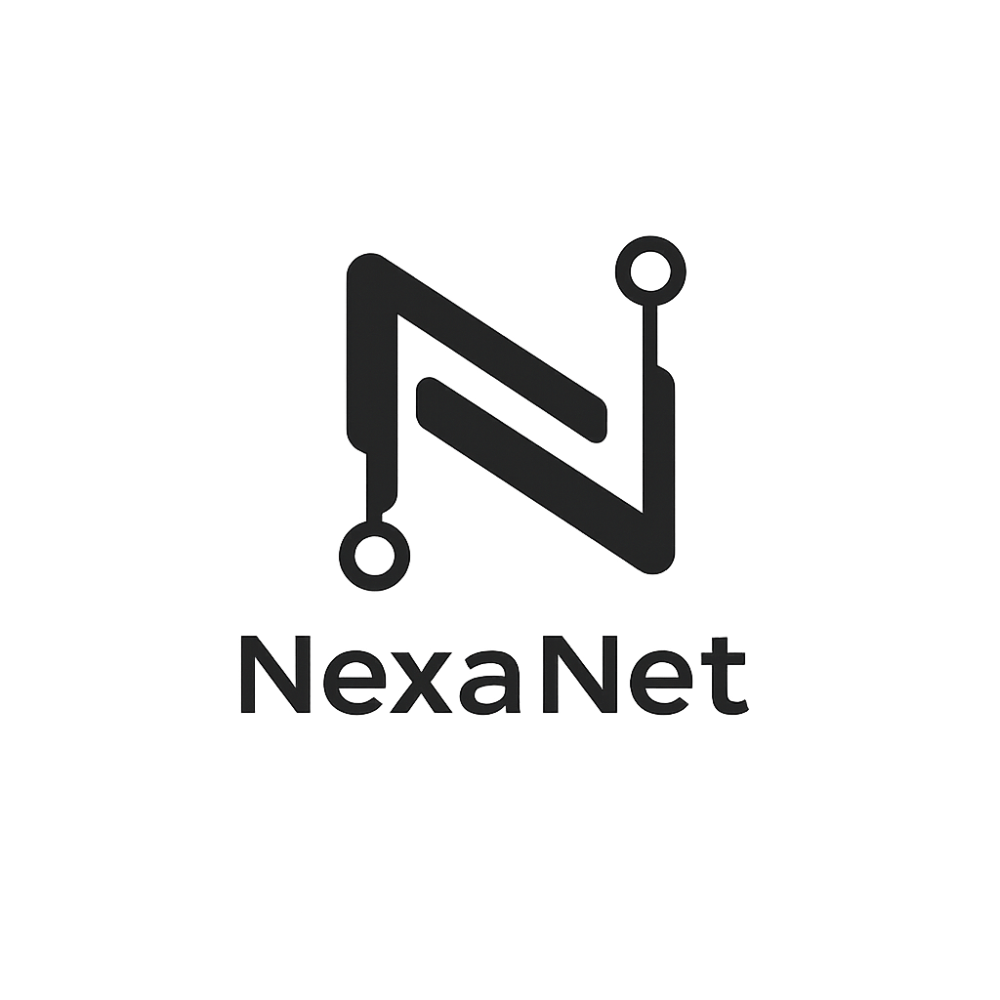

<div align="center">

<picture>
  <source media="(prefers-color-scheme: dark)" srcset="assets/white_logo.png" width="180">
  <source media="(prefers-color-scheme: light)" srcset="assets/black_logo.png" width="180">
  
</picture>

<br><br>

**Container orchestration for the rest of us.**

80% of Kubernetes. 20% of the complexity. Two binaries. Zero dependencies.

[](LICENSE)
[](https://www.rust-lang.org)
[](https://github.com/nexa-net/nexa-core/actions)
[](https://github.com/nexa-net/nexad/actions)
[](https://github.com/nexa-net/nexa-cli/actions)
[](https://github.com/nexa-net/nexa-proxy/actions)

[Install](#install) · [Quick Start](#quick-start) · [Features](#features) · [Architecture](#architecture) · [Docs](#documentation)

</div>

---

## Why NexaNet?

Kubernetes is powerful — and overwhelming. etcd, kubelet, kube-proxy, CRDs, operators, Helm charts, YAML-of-YAML... For most teams, it's 10x more infrastructure than they actually need.

**NexaNet is the alternative.** A single daemon (`nexad`) and a single CLI (`nexa`). Deploy containers, scale across nodes, get automatic TLS, and call it a day. No PhD in YAML required.

```
You know this:                     You can skip this:
─────────────                      ──────────────────
nexa deploy app.yaml               etcd cluster setup
nexa scale api 5                   Custom Resource Definitions
nexa logs api --tail 100           Helm chart templating
nexa route add api.example.com     Ingress controller config
                                   Service mesh sidecar injection
                                   Pod security policies
                                   ...you get the idea
```

---

## Install

```bash
curl -sSfL https://raw.githubusercontent.com/nexa-net/nexa/main/install.sh | sh
```

This installs both `nexad` (daemon) and `nexa` (CLI) to `/usr/local/bin`. Supports Linux (amd64/arm64) and macOS (amd64/arm64).

<details>
<summary><b>Build from source</b></summary>

```bash
# Requires Rust 1.85+ and Docker or containerd running on the host

# Build the daemon
git clone https://github.com/nexa-net/nexad.git
cd nexad && cargo build --release

# Build the CLI
git clone https://github.com/nexa-net/nexa-cli.git
cd nexa-cli && cargo build --release
```

</details>

---

## Quick Start

**1. Start the daemon**

```bash
nexad
```

**2. Deploy a service**

```yaml
# app.yaml
project: myapp

deployment:
  name: api

replicas: 3
image: ghcr.io/company/api:latest

ports:
  - 3000

network:
  public: true
  domain: api.example.com
  https: true

healthcheck:
  path: /health
  interval: 10s
```

```bash
nexa deploy app.yaml
```

**3. You're live**

```bash
nexa status          # cluster overview
nexa pods            # running containers
nexa logs api        # stream logs
nexa scale api 10    # scale to 10 replicas
```

That's it. No init scripts, no cluster bootstrapping, no 47-page getting-started guide.

---

## Features

<table>
<tr>
<td width="50%">

### Deploy in seconds

```bash
nexa deploy app.yaml
nexa status
```

Write a simple YAML spec. Deploy with one command. No Helm, no Kustomize, no templating engine.

</td>
<td width="50%">

### Multi-node clustering

```bash
# On the master
nexad --mode master

# On workers — one command to join
nexad --mode worker \
  --join 10.0.1.1:6444 \
  --token <TOKEN>
```

</td>
</tr>
<tr>
<td width="50%">

### Automatic TLS

```yaml
network:
  domain: api.example.com
  https: true
```

Let's Encrypt certificates provisioned and renewed automatically. Zero config.

</td>
<td width="50%">

### Built-in service discovery

Every deployment gets a DNS name:

```
<deployment>.<project>.internal
```

No CoreDNS setup. No service mesh. It just works.

</td>
</tr>
<tr>
<td width="50%">

### Encrypted secrets

```bash
nexa secret set DB_PASS s3cret -p myapp
```

AES-256-GCM encryption at rest. Per-node master keys. Injected as environment variables.

</td>
<td width="50%">

### Health checking & restart

```yaml
healthcheck:
  path: /health
  interval: 10s
  timeout: 5s
  retries: 3

restart: always
```

HTTP, TCP, and exec probes with automatic restart on failure.

</td>
</tr>
<tr>
<td width="50%">

### Weighted scheduling

Spread or bin-pack strategies across heterogeneous nodes. Weighted round-robin load balancing for traffic.

</td>
<td width="50%">

### Runtime flexibility

Docker and containerd supported out of the box. Auto-detected at startup — no config needed.

</td>
</tr>
</table>

<br>

<details>
<summary><b>Full feature list</b></summary>

| Category | Feature |
|---|---|
| **Orchestration** | Declarative YAML deployments, rolling updates, replica scaling |
| **Clustering** | Master/worker topology, gRPC transport, join tokens, heartbeat monitoring |
| **Scheduling** | Weighted spread/bin-pack strategies, automatic pod rescheduling on node failure |
| **Networking** | WireGuard overlay mesh, per-project subnet allocation, CNI plugin support |
| **Service Discovery** | Embedded DNS server resolving `<service>.<project>.internal` |
| **Routing** | Built-in reverse proxy, nginx/Caddy/Traefik backends, host-based routing |
| **TLS** | ACME auto-provisioning, certificate import, daily renewal |
| **Secrets** | AES-256-GCM encryption at rest, per-node master keys |
| **Health** | HTTP/TCP/exec probes, configurable thresholds, automatic restart policies |
| **Projects** | Logical isolation with suspend/resume, resource management |
| **Runtimes** | Docker (bollard) and containerd (ctr) with auto-detection |
| **State** | SQLite persistence — no external database required |
| **CLI** | Full resource management, JSON output mode, styled terminal tables |

</details>

---

## CLI Reference

```bash
# Deployments
nexa init [NAME] [--image IMAGE]     # scaffold a project interactively
nexa deploy <FILE>                   # deploy from YAML spec
nexa scale <NAME> <N> [-p PROJECT]   # scale replicas
nexa stop <NAME> [-p PROJECT]        # stop a deployment
nexa rm <NAME> [-p PROJECT]          # remove a deployment
nexa logs <NAME> [-p PROJECT]        # stream container logs

# Cluster
nexa status                          # cluster overview
nexa pods [-p PROJECT]               # list running containers
nexa deployments [-p PROJECT]        # list deployments
nexa nodes                           # list cluster nodes

# Projects
nexa project create <NAME>           # create isolation boundary
nexa project suspend <NAME>          # pause all deployments
nexa project resume <NAME>           # resume paused project
nexa project delete <NAME>           # tear down everything

# Networking
nexa route add <DOMAIN> -p PROJECT --deployment NAME [--https]
nexa routes [-p PROJECT]             # list routes
nexa cert import <DOMAIN> --cert FILE --key FILE

# Secrets
nexa secret set <NAME> <VALUE> -p PROJECT
nexa secret list -p PROJECT

# All commands support --json for scripting
nexa pods --json | jq '.[] | .name'
```

---

## Documentation

| Topic | Link |
|:--|:--|
| Deployment spec format | [`nexad` README](https://github.com/nexa-net/nexad#deployment-specs) |
| REST API reference | [`nexad` README](https://github.com/nexa-net/nexad#rest-api) |
| CLI commands | [`nexa-cli` README](https://github.com/nexa-net/nexa-cli#command-reference) |
| Proxy configuration | [`nexa-proxy` README](https://github.com/nexa-net/nexa-proxy#configuration) |
| Clustering guide | [`nexad` README](https://github.com/nexa-net/nexad#clustering) |

---

## Comparison

| | NexaNet | Kubernetes | Docker Swarm | Nomad |
|---|:---:|:---:|:---:|:---:|
| Binaries to install | **2** | 5+ | 1 (Docker) | 1 |
| External dependencies | **None** | etcd, container runtime | Docker | Consul (optional) |
| Config language | **YAML** | YAML + Helm/Kustomize | YAML | HCL |
| Built-in TLS | **Yes** | No (cert-manager) | No | No (Vault) |
| Built-in DNS | **Yes** | CoreDNS (separate) | Yes | Consul |
| Built-in proxy | **Yes** | No (ingress controller) | Routing mesh | No |
| Learning curve | **Hours** | Weeks-months | Days | Days |
| Written in | **Rust** | Go | Go | Go |

---

## Repositories

NexaNet is organized as a multi-repo project under the [`nexa-net`](https://github.com/nexa-net) GitHub organization:

| Repository | Description | |
|:--|:--|:--|
| **[`nexa`](https://github.com/nexa-net/nexa)** | This repo — documentation, specs, install script | [](#) |
| **[`nexa-core`](https://github.com/nexa-net/nexa-core)** | Core library — domain types, port traits, orchestrator | [](https://github.com/nexa-net/nexa-core/actions) |
| **[`nexad`](https://github.com/nexa-net/nexad)** | Daemon — runtime adapters, REST API, clustering | [](https://github.com/nexa-net/nexad/actions) |
| **[`nexa-cli`](https://github.com/nexa-net/nexa-cli)** | CLI tool — deploy, scale, manage from the terminal | [](https://github.com/nexa-net/nexa-cli/actions) |
| **[`nexa-proxy`](https://github.com/nexa-net/nexa-proxy)** | Reverse proxy — HTTP/HTTPS with weighted load balancing | [](https://github.com/nexa-net/nexa-proxy/actions) |

---

## Contributing

NexaNet is Apache-2.0 licensed and contributions are welcome. Each repository has its own CI pipeline — make sure `cargo fmt --check`, `cargo clippy -- -D warnings`, and `cargo test` pass before submitting a PR.

## License

[Apache-2.0](LICENSE)
